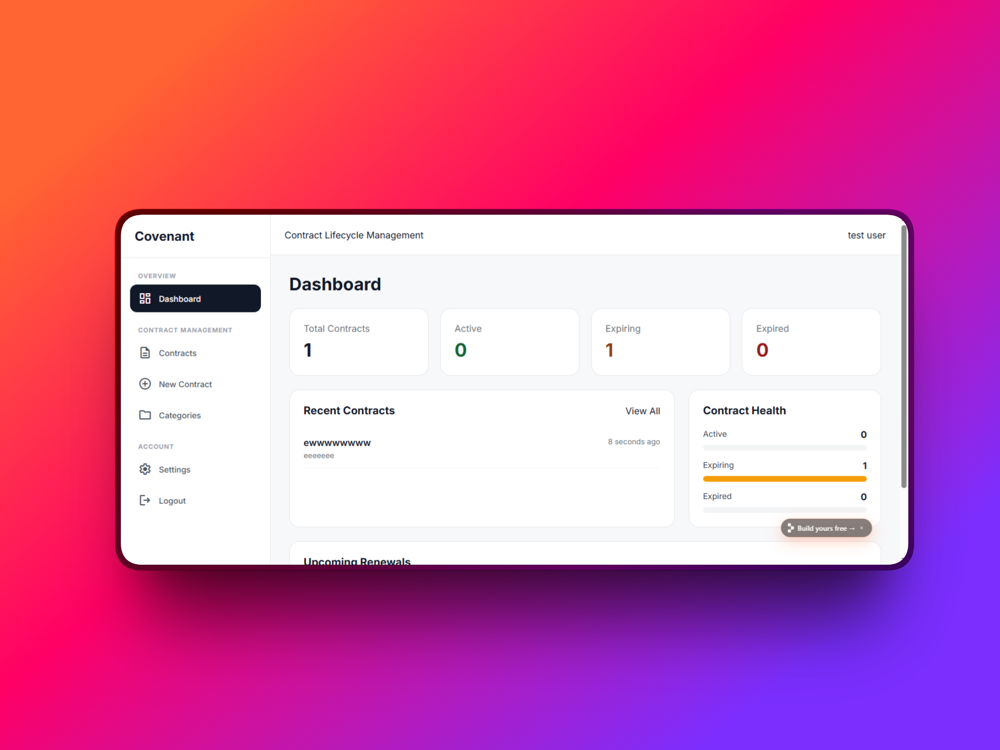
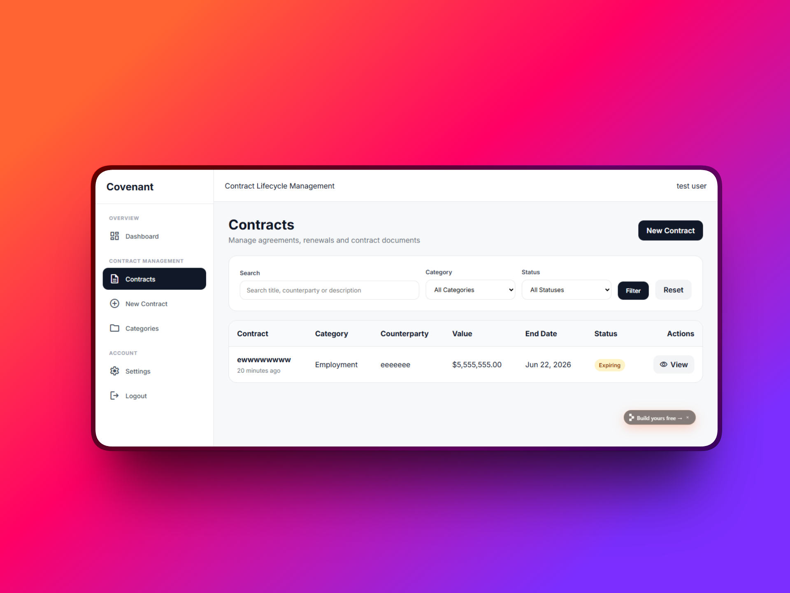

# Covenant

Covenant is a Laravel + Blade contract lifecycle management system for storing agreements, tracking renewals, monitoring expiry dates, managing categories, and organizing contract documents from a clean dashboard.

---

## Screenshots

### Dashboard



### Contract Management



---

## Features

- Authentication: register, login, password reset, profile update, password update, account deletion
- Contract CRUD: create, view, edit, delete
- Contract document upload and download
- Contract categories with contract counts
- Search contracts by title, counterparty, or description
- Filter contracts by category and lifecycle status
- Automatic status calculation: Active, Expiring, Expired
- Renewal countdown badges
- Dashboard metrics and contract health overview
- Toast notifications
- Loading states
- Modal confirmation workflows
- Responsive sidebar and mobile layout
- Material Symbols icons

---

## Tech Stack

- PHP 8.4+
- Laravel 13
- Laravel Breeze
- Blade
- SQLite (local development)
- MySQL (production)
- Alpine.js
- Material Symbols

---

## Requirements

- PHP 8.4 or higher
- Composer
- SQLite extension for local development
- MySQL for production
- Writable `storage` and `bootstrap/cache` directories

---

## Local Installation

Clone the repository:

```bash
git clone https://github.com/wbizmo/covenant.git
cd covenant
```

Install dependencies:

```bash
composer install
```

Create environment file:

```bash
cp .env.example .env
```

Generate application key:

```bash
php artisan key:generate
```

Create SQLite database:

```bash
touch database/database.sqlite
```

Update `.env`:

```env
DB_CONNECTION=sqlite
```

Run migrations and seeders:

```bash
php artisan migrate
php artisan db:seed
```

Create storage link:

```bash
php artisan storage:link
```

Start development server:

```bash
php artisan serve
```

Open:

```txt
http://localhost:8000
```

---

## Shared Hosting Installation

Covenant can be deployed on most cPanel hosting providers that support PHP 8.4+.

### Database Setup

Create a MySQL database and database user from cPanel, then update your `.env` file:

```env
APP_ENV=production
APP_DEBUG=false
APP_URL=https://yourdomain.com

DB_CONNECTION=mysql
DB_HOST=localhost
DB_PORT=3306
DB_DATABASE=your_database_name
DB_USERNAME=your_database_user
DB_PASSWORD=your_database_password
```

### Upload Project

Upload the project files to your hosting account and extract them outside `public_html`.

Recommended structure:

```txt
/home/username/covenant
/home/username/public_html
```

Point your domain document root to:

```txt
/home/username/covenant/public
```

### Final Setup

Run database migrations and create the storage link if your hosting provider offers terminal access:

```bash
php artisan migrate --force
php artisan storage:link
```

Ensure these folders are writable:

```txt
storage
bootstrap/cache
```

---

## Roadmap

Planned improvements for future versions:

- Currency selection
- Multi-currency contract values
- CSV export
- PDF export
- Activity logs
- Contract reminders
- Email renewal alerts
- Team workspaces
- Role permissions
- Audit history
- Contract approval workflows

---

## Author

Built by Williams.

GitHub: https://github.com/wbizmo

---

## License

This project is open-sourced under the MIT License.